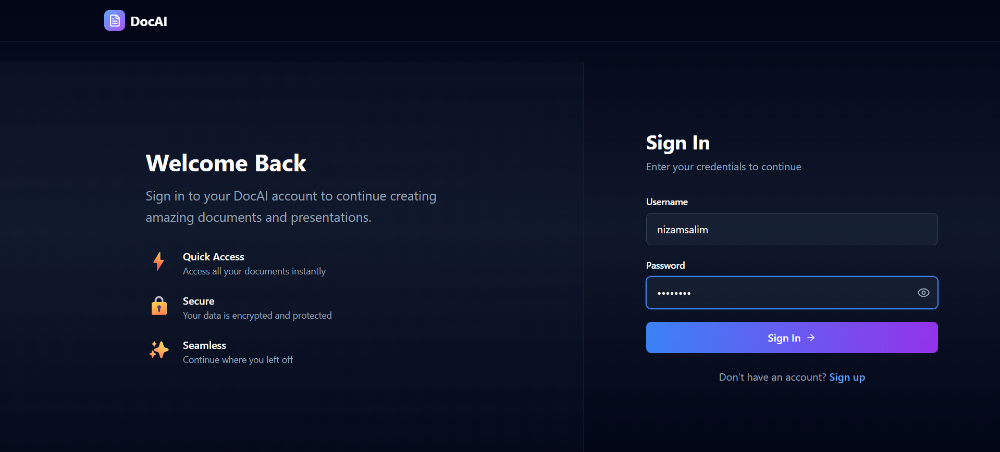
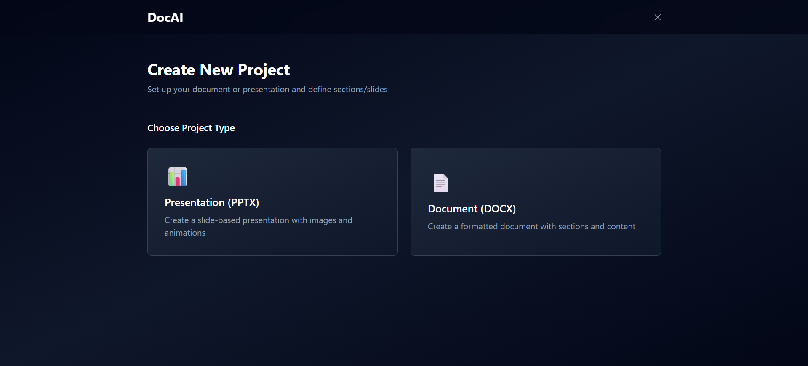
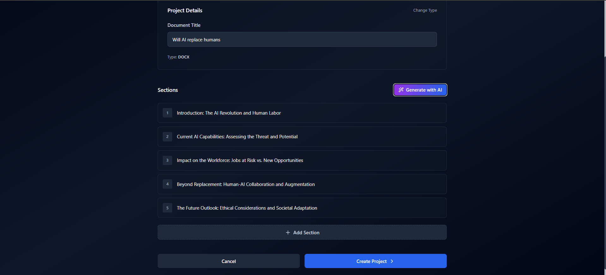
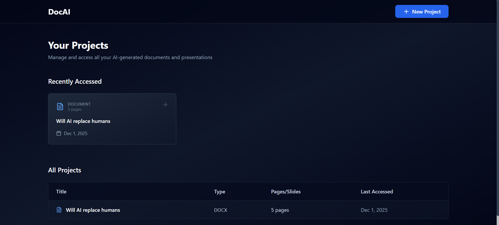
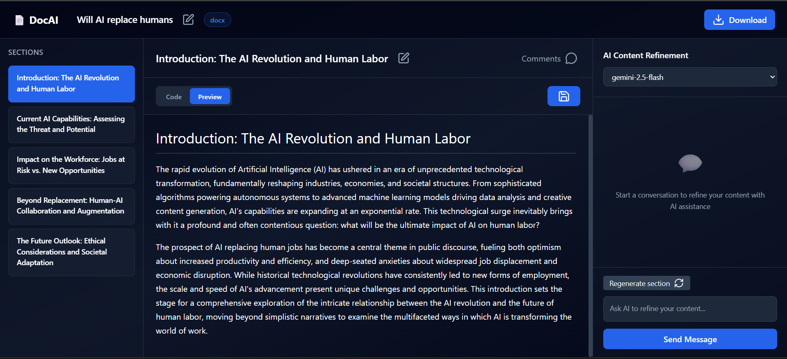
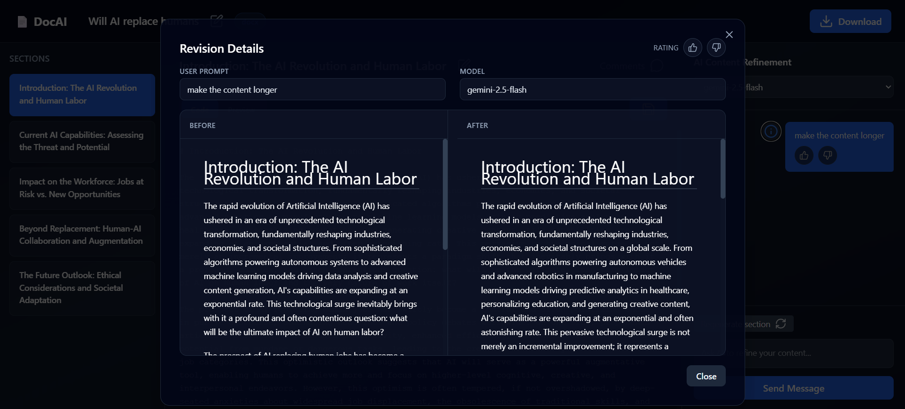
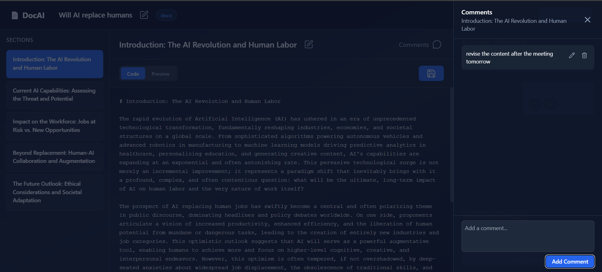

## 📄 DocAI Frontend Description

DocAI is a web application that revolutionizes **document creation** by allowing users to generate **Word** and **PowerPoint (PPT)** documents simply by providing the **project title** and the desired **section/slide titles**.

---

### 💡 Core Features

- **Content Generation:**
  - Users can generate initial document content by providing a project title and section/slide titles.
  - Users can also opt to have the **AI generate the section/slide titles** automatically, based solely on the project title.
  - All content generation is powered by **advanced LLM models**.
- **Iterative Refinement:**
  - After the initial generation, users can **refine the content iteratively** using an **integrated chat interface** with the LLM.
- **Model Selection:**
  - Users have the flexibility to select the underlying LLM model for generation and refinement, with options including: **Gemini**, **GPT**, and **LLaMA**.
- **Refinement History & Feedback:**
  - A **history view** allows users to see the **changes** brought about by **each refinement** step.
  - For each refinement, the following metadata is tracked:
    - **Model used**
    - **Prompt used**
  - Users can provide feedback on the refinements by **liking or disliking** them.
- **User Comments:**
  - Users can **add comments per section/slide** to record notes or reminders for later use.

---

## 📷 Application screenshots

1. **Login**  
   

2. **Select project type**
   

3. **Create project**
   

4. **Projects list**
   

5. **Project view**
   

6. **Refinement history**
   

7. **Comments**
   

## 🛠️ Running Instructions

To set up and run the DocAI frontend locally, follow these steps:

1.  **Clone the remote repository:**
    ```bash
    git clone https://github.com/nizamsalim/docai_frontend
    cd docai_frontend
    ```
2.  **Install dependencies:**
    ```bash
    npm install
    ```
3.  **Start the development server:**
    ```bash
    npm run dev
    ```

---

## ⚙️ Environment Variables

The application requires the following environment variable to connect to the backend API:

| Variable Name  | Description                           |
| :------------- | :------------------------------------ |
| `VITE_API_URL` | The URL of the DocAI backend service. |
